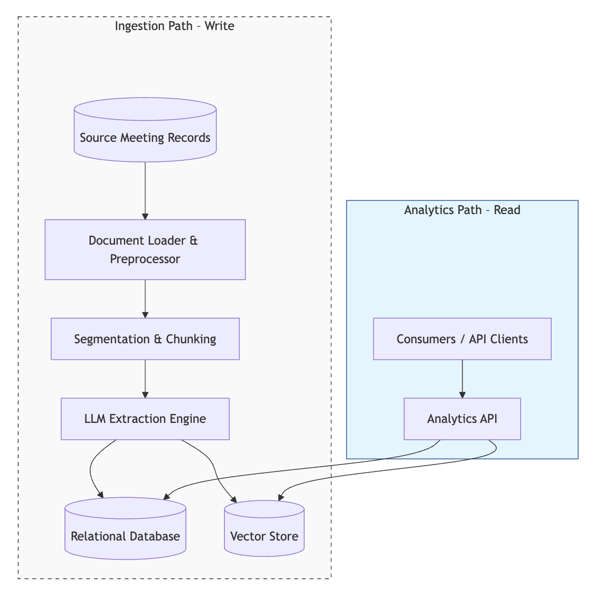
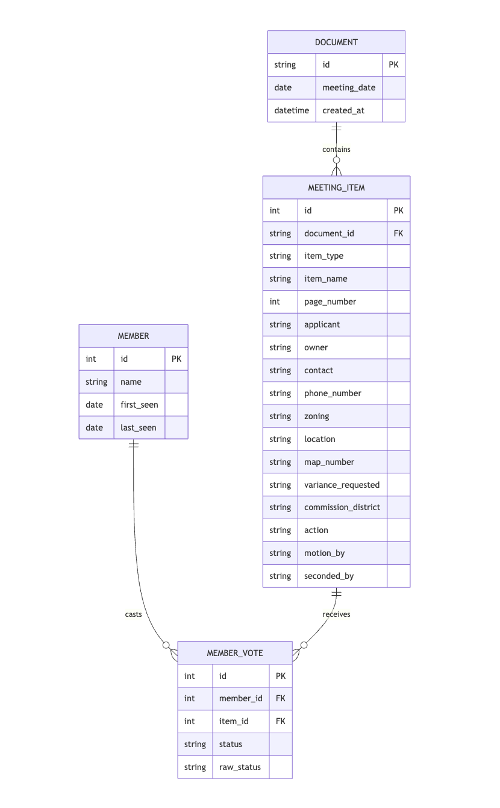

# System Design Document

## 1. Overview

The **Zoning Governance Analytics Platform** is a data-extraction and normalization system designed to make municipal zoning decisions more transparent and analyzable. It processes zoning meeting minutes that typically vary in structure, density, and formatting—documents where key decision data is often buried inside long narrative descriptions.

The system converts these unstructured records into a clean relational schema, enabling reproducible analysis of meeting items, board actions, and individual voting behavior. By centralizing this information in a queryable format, the platform supports longitudinal insights into zoning trends, procedural consistency, and member-level decision patterns.

## 2. System Architecture

The platform is designed as a **Structured Extraction Engine** that prioritizes mapping narrative text to a strictly-typed relational schema. While built on a modular RAG architecture, it moves beyond simple document summarization to support precise, historical analytics.

### 2.1 Design Philosophy
* **Simple → Modular → Decomposable**: The system follows a pragmatic evolution path. Each submodule (Loader, Embedder, Extractor) is isolated via defined interfaces. This allows the system to scale from a local batch loop to a distributed microservice architecture without a core rewrite.
* **Decoupled Paths**: A strict separation is maintained between the **Ingestion (Write) Path** and the **Analytics (Read) Path**. This ensures that heavy LLM processing overhead never impacts the responsiveness of the query layer.
* **Plug-and-Play Extensibility**: Components are designed to be swappable. This allows for A/B testing of different LLMs and the injection of **Mock Inputs** at various stages to verify edge cases without reprocessing the entire dataset.

### 2.2 Design Assumptions
* **Throughput over Latency**: For the V1 phase, high accuracy in structured extraction is prioritized over real-time processing. The system assumes a batch-processing cadence is acceptable for municipal record updates.
* **PDF-Native Sources**: Based on representative data, the system assumes high-variance PDF layouts. The loading layer is modular to allow for "parser-swapping" as document formats evolve.
* **"Wedge" Strategy**: The architecture focuses on a "proof-of-concept wedge"—solving the hard problem of structured extraction first—while providing the hooks (Vector IDs linked to SQL records) to scale into a full-scale regional platform.

### 2.3 High-Level Components
* **Ingestion Pipeline**: A standard Python orchestrator (avoiding heavy "black-box" frameworks) that manages the flow from raw PDF to structured storage.
* **Hybrid Storage Layer**:
    * **Relational DB (SQLite)**: The **System of Record** for structured, normalized entities (Members, Votes, Items).
    * **Vector Store (ChromaDB)**: Provides semantic discovery and high-relevance context for the LLM during the extraction phase.
* **FastAPI Interface**: Selected for its native Pydantic integration, providing a clean async API surface for both triggering ingestion and serving analytics queries.

### 2.4 System Flow Diagram


<details>
<summary>Click to expand Mermaid Source Code</summary>

```mermaid
graph TD
    subgraph Ingestion_Path [Ingestion Path – Write]
    direction TB
    Space1[ ] ~~~ A
    style Space1 fill:none,stroke:none
    
    A[(Source Meeting Records)] --> B[Document Loader & Preprocessor]
    B --> C[Segmentation & Chunking]
    C --> D[LLM Extraction Engine]
    D --> E[(Relational Database)]
    D --> F[(Vector Store)]
    end

    subgraph Query_Path [Analytics Path – Read]
    direction TB
    Space2[ ] ~~~ G
    style Space2 fill:none,stroke:none

    G[Consumers / API Clients] --> H[Analytics API]
    H --> E
    H --> F
    end

    style Ingestion_Path fill:#f9f9f9,stroke:#333,stroke-dasharray: 5 5
    style Query_Path fill:#e1f5fe,stroke:#01579b
 ```   
</details>

## 3. Ingestion Pipeline Design

The pipeline is engineered to transform high-variance, narrative-heavy municipal records into structured, queryable data. It prioritizes data integrity and traceability at every stage.

### 3.1 Document Loading & Preprocessing
To handle the complexities of the PDF format, the system employs a multi-stage loading strategy:
* **Layout-Aware Extraction**: The loader preserves the logical reading order of the minutes. This ensures that a "Motion" and its subsequent "Vote Tally" remain contextually linked even if they span across page breaks.
* **Text Normalization**: Raw text is stripped of administrative noise (headers, footers, page numbers) to optimize the LLM's context window and improve vector search relevance.

### 3.2 Context-First Segmentation
To avoid the risk of "bisecting" critical zoning actions with arbitrary character-count splitting, the system utilizes a high-context segmentation strategy:
* **Page-Level Chunking**: Documents are segmented at natural page boundaries. This provides a clean, document-native break point that preserves the integrity of administrative paragraphs.
* **Holistic Context Strategy**: Where model context limits allow, the system prioritizes passing the entire document or large multi-page blocks to the LLM. This ensures the "LLM Extraction Engine" has access to the full narrative of a case from introduction to final vote without the need for complex state management between chunks.
* **Traceable Metadata**: Every page-level segment is indexed with a `source_ref` and `page_index`, allowing any data point in the SQLite database to be audited against the exact page in the original PDF.

### 3.3 LLM Extraction & Semantic Normalization
The extraction layer functions as the system’s reasoning engine, converting semi-structured narrative text into a strictly typed relational format.

* **Non-Adjacent Context Correlation**: By segmenting at page boundaries rather than arbitrary character counts, the engine maintains sufficient context to correlate related entities—such as a petitioner’s name and a case's final disposition—even when separated by several paragraphs of discussion.
* **Schema-Driven Extraction**: The system utilizes Pydantic-defined schemas to govern the extraction process. This ensures the output adheres to the expected data types and structures required by the Relational Database, effectively bridging the gap between natural language and structured storage.
* **Semantic Entity Resolution**: The engine is tasked with resolving diverse references to a single, unique member record. This ensures longitudinal consistency across the dataset, even when official titles or naming conventions shift between meeting sessions.

## 4. Data Modeling & Schema Design

### 4.1 Rationale for the Schema
Zoning records contain a mix of structured data and dense narrative. The system utilizes a normalized relational schema to ensure data integrity and support longitudinal analysis that a flat-file approach cannot provide.

* **Board Member Identity**: Tracking individuals and their behavior across multi-year sessions.
* **Granular Action Tracking**: Treating each zoning motion as a distinct, auditable entity.
* **Relational Integrity**: Strictly linking individual votes to specific items and source documents via foreign keys.

### 4.2 Data Model / ERD 


<p align="left">
  
</p>

<details>
<summary>Click to expand Mermaid Source Code</summary>

```mermaid
erDiagram
    MEMBER ||--o{ MEMBER_VOTE : casts
    MEETING_ITEM ||--o{ MEMBER_VOTE : receives
    DOCUMENT ||--o{ MEETING_ITEM : contains

    MEMBER {
        int id PK
        string name
        date first_seen
        date last_seen
    }

    MEMBER_VOTE {
        int id PK
        int member_id FK
        int item_id FK
        string status
        string raw_status
    }

    MEETING_ITEM {
        int id PK
        string document_id FK
        string item_type
        string item_name
        int page_number
        string applicant
        string owner
        string contact
        string phone_number
        string zoning
        string location
        string map_number
        string variance_requested
        string commission_district
        string action
        string motion_by
        string seconded_by
    }

    DOCUMENT {
        string id PK
        date meeting_date
        datetime created_at
    }
```
</details>

### 4.3 Hybrid Storage Approach

While the Relational Model (SQLite) acts as the **System of Record** for voting outcomes, the architecture is designed for a hybrid approach to data retrieval:

* **Relational Store (SQLite)**: Optimized for **"Hard" questions** and structured aggregation. 
    * *Example:* "What is the approval rate for Applicant Y across all 2024 sessions?"
* **Vector Store (ChromaDB)**: Optimized for **"Soft" questions** and semantic discovery. 
    * *Example:* "Find all cases involving residential setbacks or similar environmental concerns." 

By indexing document embeddings with the same `document_id` used in the relational schema, the system enables cross-functional queries that combine statistical trends with deep-text context.

## 5. Retrieval & Analytics Interface

The platform provides a unified API layer to access structured outcomes and semantic context, abstracting the underlying database complexity from the consumer.

### 5.1 Relational Retrieval (Structured Analytics)
The primary retrieval mechanism for V1 is a set of **RESTful endpoints** that expose high-precision analytics and auditability:
* **Member Profiles**: Aggregated statistics for board members, including their full voting history and "first/last seen" dates to track tenure.
* **Voting Timelines**: A filterable stream of actions, allowing for per-member, per-item type, or per-date analysis of zoning decisions.
* **Meeting Item Details**: Deep-dives into specific cases, surfacing metadata like petitioners, zoning types, and specific requested variances alongside the final vote tally.
* **Audit Trails**: Every retrieved record maintains a link to its origin (`document_id` and `page_number`), providing a "trust layer" essential for governance tools.

### 5.2 Semantic Discovery (Planned Vector Retrieval)
The architecture includes a **Vector Retrieval Path** (via ChromaDB) intended for "soft" exploratory queries. While the current implementation prioritizes relational correctness, the underlying storage enables:
* **Similarity Search**: Finding meeting items with similar narrative descriptions, legal challenges, or recurring community concerns.
* **Contextual Grounding**: Providing the LLM with relevant historical case precedents to improve future extraction accuracy.
* **Semantic Exploration**: Allowing users to search across narrative text to identify patterns that are not captured by structured fields alone.

### 5.3 Hybrid Query Abstraction & Scaling
To manage cost and latency, the retrieval layer is designed to distinguish between **Relational-only** (low latency, 0 token cost) and **LLM-Augmented** (higher latency, variable token cost) queries. This abstraction allows the system to scale its "intelligence" based on the user's specific information needs, ensuring the platform remains performant as the dataset grows.

## 6. AI/LLM Integration Strategy

The extraction engine is designed to bridge the gap between "noisy" administrative narratives and a strict relational schema. The strategy prioritizes **structural integrity** and **auditability** over simple summarization.

### 6.1 Model Selection Rationale
* **LLM (OpenAI GPT-4o / gpt-4o-mini)**: Selected for the V1 phase due to superior reasoning capabilities in "Zero-Shot" extraction. GPT-4o's large context window allows for processing entire page segments without losing the relationship between petitioners and final actions.
* **Embeddings (HuggingFace / Sentence-Transformers)**: Utilizing a local embedding model ensures that the semantic indexing of document chunks remains high-speed and cost-effective, while providing the flexibility to swap models as the domain-specific vocabulary of zoning (e.g., "interparcel access," "C-2 zoning") requires fine-tuning.

### 6.2 Schema-Driven Extraction (Pydantic)
To mitigate LLM hallucinations and structural variance, the system utilizes **Pydantic-based schema enforcement**:

* **Strict Typing**: The LLM is constrained to output JSON that matches the SQL schema exactly, bridging the gap between natural language and relational storage.
* **Validation Layer**: Any extraction failing validation (e.g., missing mandatory fields or invalid vote types) is caught before database insertion, ensuring the "System of Record" remains clean.

### 6.3 Evaluation & Testing Harness
The system implements a multi-stage mocking strategy (exposed via the `/ingest` endpoint's `use_mock` parameter and internal flags). This architecture allows the system to bypass live LLM calls, PDF extraction, or chunking in favor of deterministic snapshots. This provides:

* **Pipeline Component Isolation**: The ability to bypass specific upstream stages (like PDF text extraction) to test downstream logic (like Relational Mapping) using "Golden Set" inputs.
* **LLM Consistency Testing**: By holding inputs constant and using mocked responses, the system can evaluate how changes in prompts or Pydantic validation rules impact data integrity without external non-determinism.
* **Rapid Logic Iteration**: Developers can test complex relational constraints and edge cases using known-good extraction "stubs," significantly reducing the development-to-test cycle.
* **Mock Injection Points**: The modular design allows for mocking at the **Source Text**, **Segmented Chunk**, or **Extracted JSON** level, enabling full-pipeline verification without incurring API costs or processing overhead.

## 7. Handling Document Format Variability

Municipal records are notoriously inconsistent. Over a multi-year period, document layouts, font styles, and even the terminology used for "votes" can shift. The system treats this variability as a core constraint rather than an edge case.

### 7.1 Layout-Aware Preprocessing
Traditional text extraction often "flattens" PDFs, losing the relationship between headers and body text. The system's loading layer preserves the **logical reading order**, ensuring that:
* **Contextual Proximity**: A board member's name and their specific motion remain linked in the text stream, even if they appear in a non-standard table or sidebar.
* **Noise Reduction**: Administrative boilerplate (headers, footers, page numbers) is identified and handled, preventing it from "polluting" the LLM's extraction context.

### 7.2 Semantic Smoothing vs. Structural Parsing
The system deliberately avoids **Regex-based** or **Position-based** parsing, which are brittle against even minor formatting changes.
* **The Problem**: One PDF might list a vote as "5-0-0," while another uses "Unanimous," and a third lists individual names under "Dissenting."
* **The Solution**: By using the LLM as a **Semantic Parser**, the system "smooths out" these variations. The model understands the *intent* of the text—identifying a "Yes" vote regardless of whether it was expressed as a checkbox, a name in a list, or a narrative sentence.

### 7.3 Page-Level Anchor Strategy
By segmenting at **page boundaries**, the system maintains a "document-native" anchor. If a specific meeting item spans two pages, the LLM’s context window is large enough to bridge that gap, correlating the introduction of a case on Page 2 with the final vote on Page 3—a task that would require complex state management in a traditional character-count chunking approach.

## 8. Scaling & Reliability

The current architecture is optimized for accuracy and "0-to-1" velocity. Scaling the platform to 10x or 100x volume involves managing shifting bottlenecks through structural changes rather than just increasing compute resources.

### 8.1 Scaling Framework (10x to 100x)
* **Phase 1 (Regional Scale)**: As the document volume grows, the primary bottleneck will shift to **ingestion latency**. 
    * *Strategy*: Transition from a synchronous batch loop to an **Asynchronous Task Architecture** to process documents in parallel.
    * *Storage*: Migrate from a single-file SQLite database to a **Managed Relational Cluster** to handle increased concurrent write operations and complex indexing.
* **Phase 2 (National Scale)**: At 100x volume, the bottleneck shifts to **Search & Retrieval** across millions of text segments.
    * *Strategy*: Implement **Distributed Vector Indexing** and consider **Multi-tenant Data Isolation** strategies to ensure performance remains consistent across different jurisdictions.

### 8.2 Reliability & Data Quality
* **Validation Gate**: The system utilizes Pydantic to ensure that only "Schema-Valid" data enters the relational store, preventing downstream analytics errors.
* **Error States**: Documents that fail during extraction are flagged with a `PARTIAL` or `FAILED` status in the `DOCUMENT` table, allowing for targeted re-ingestion without polluting the clean analytics data.
* **Current Limitation (Idempotency)**: The V1 pipeline operates on an **Append-Only** logic. To prevent duplicate records during re-runs, the current recommendation is to refresh the SQLite database file. 
* **Roadmap Fix**: Future iterations will implement a **"Check-and-Skip"** guard or **SQL UPSERT** logic, keyed on a unique hash of the source document, to ensure idempotency across multiple ingestion cycles.

## 9. Technical Trade-offs & Scaling

### 9.1 Storage Architecture: Portability & Iteration Velocity
The storage stack was selected to prioritize rapid iteration, evaluation, and local portability, while minimizing external service dependencies.

* **Relational Layer (SQLite + SQLAlchemy)**: 
    * **Rationale**: SQLite provides a zero-configuration, single-file "system of record" for the V1 phase. By using **SQLAlchemy** as the ORM, the system implements a **Database-Agnostic** pattern. While SQLite is a single-machine solution, the ORM allows for a seamless migration to an enterprise-grade RDBMS (e.g., PostgreSQL) by simply updating the connection string.
* **Vector Layer (ChromaDB)**: 
    * **Rationale**: ChromaDB was selected for its **Local-First** flexibility. Unlike managed vector services, it allowed for the use of custom, locally-run embedding models, which significantly reduced latency and removed external API dependencies during the "0 to 1" development phase.
    * **State Management**: While the current implementation utilizes a persistent local instance for durability, the architecture is designed to transition to a horizontally scalable solution (e.g., pgvector or a managed cloud DB) as the dataset expands beyond a single jurisdiction.

### 9.2 The Evolution Path
As the corpus grows from a single municipality to a regional dataset, the architecture is designed to scale:

| Level | Vector Storage | Persistence | Complexity |
| :--- | :--- | :--- | :--- |
| **Prototype** | In-Memory (Custom) | Volatile (RAM) | Low |
| **Current (V1)** | **ChromaDB (Local)** | **Persistent (Disk)** | **Medium** |
| **Production (V2)** | Pinecone / pgvector | Managed Cloud | High |

### 9.3 Reliability over Complexity (Chunking Strategy)
A significant trade-off was made in choosing **Page-Level Chunking** over structural parsing. 
* **The Decision**: Structural parsing (e.g., regex for "Case Numbers") is brittle across decades of shifting PDF formats.
* **The Defense**: Page-level boundaries provide a "document-native" anchor that ensures **zero data loss**. By leveraging the LLM’s reasoning to filter headers/footers during extraction, the system gains robustness that a hard-coded parser cannot match.

## 10. Future Roadmap
* **Natural Language Query Interface**: Integrating a RAG (Retrieval-Augmented Generation) loop to allow plain-English questions against the SQLite analytics.
* **Multi-Jurisdictional Support**: Expanding the schema to support comparative voting analysis between different city boards.
* **Semantic Chunking**: Moving beyond page boundaries to model-identified "logical" breaks in administrative discussion.


